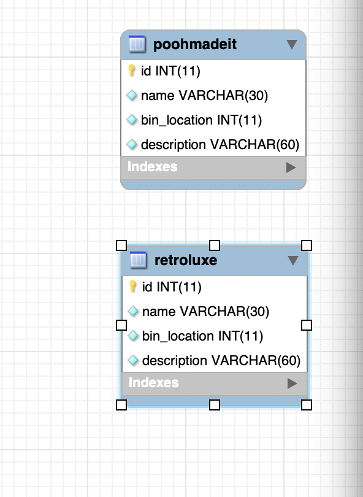
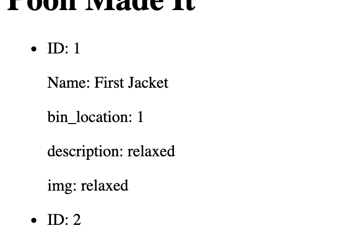
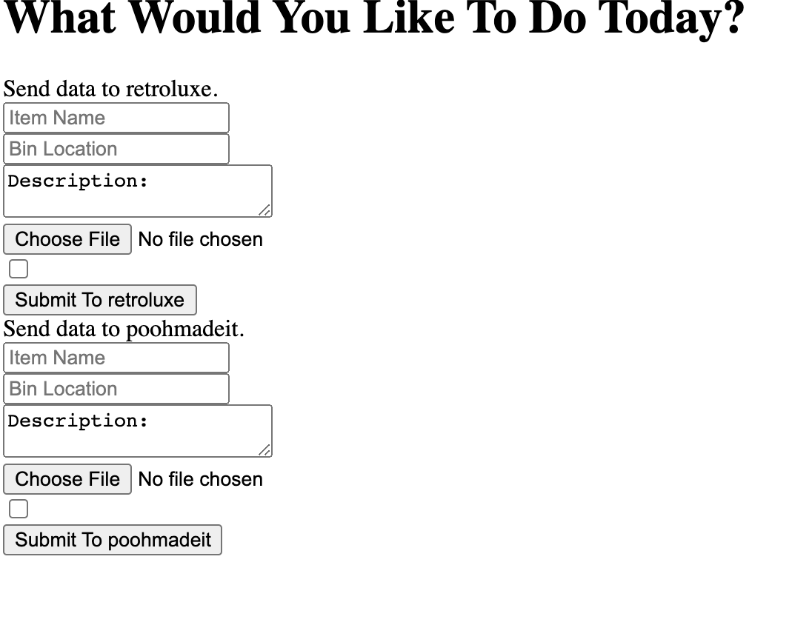

# barbara-api
Barbara's Database

#### Click Here

<!-- [Website Page](https://retroluxe.herokuapp.com/) -->

<!-- 
[Github Link](https://github.com/dagreatcode/barbara-api.git) -->

## Description 

In this project, I made a simple MySQL database, a express server, and deployed to Heroku. This database uses a JAWS database for a online service. The user can keep track of all of their items. 

# ER Diagram

## This shows the collections/ tables.

# Database pages

You can visit a collection by /poohmadeit , and also /retroluxe

This is a API site. Only made to hold data for a every long time. Updates will always be made on this site for the better. After all the functions are done, I will be making the front end look great. The user gets to fully custom the image of the site. The user will be able to Create Read Update Delete. Soon they will add more functions to the site...

## Table of Contents

* [Installation](#installation)
* [Usage](#usage)
* [Credits](#credits)
* [License](#license)

## Installation

- [x] @mentions, #refs, [links](), **formatting**, and <del>tags</del> supported
- [x] list syntax required (any unordered or ordered list supported)
- [x] this is a complete item
- [ ] this is an incomplete item

What are the steps required to install your project? Provide a step-by-step description of how to get the development environment running.

## Usage 

Name | Bin Location
------------ | -------------
Blah.1 | Blah.2
Content in the first column | Content in the second column

## Credits

## License

The last section of a good README is a license. This lets other developers know what they can and cannot do with your project. If you need help choosing a license, use [https://choosealicense.com/](https://choosealicense.com/)

---

🏆 The sections listed above are the minimum for a good README, but your project will ultimately determine the content of this document. You might also want to consider adding the following sections.

## Badges 

:sweat_drops:
:light_rail:
:scroll:
:boom:
:books:
:notebook:
:rocket:
:sparkles:
:curly_loop:

https://retroluxe.herokuapp.com/

Badges aren't _necessary_, per se, but they demonstrate street cred. Badges let other developers know that you know what you're doing. Check out the badges hosted by [shields.io](https://shields.io/). You may not understand what they all represent now, but you will in time.

## Contributing

If you created an application or package and would like other developers to contribute it, you will want to add guidelines for how to do so. The [Contributor Covenant](https://www.contributor-covenant.org/) is an industry standard, but you can always write your own.

## Tests

Go the extra mile and write tests for your application. Then provide examples on how to run them.

---
© Vincent Kendrick Services, DaGreatCode, Inc. brand. All Rights Reserved.

